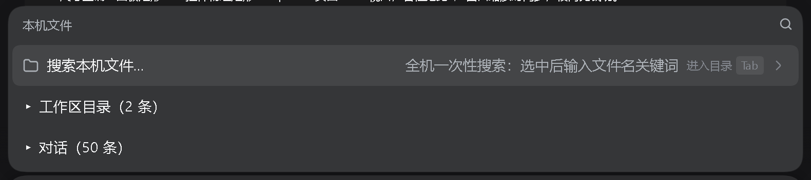

# dsh-local-file-search

> **The vk build only**: position — claims no UI position: adds a machine-wide file search to the composer `@` menu; install the [dsh-vk-suite](https://github.com/Ln1m/dsh-vk-suite) contract + skeleton first.
> Conflicts: a slot renders only its highest-priority entry, and two registrations at the same priority throw; mutually exclusive with anything claiming the same position (see "How to use it / what it conflicts with" in [dsh-vk-suite](https://github.com/Ln1m/dsh-vk-suite)).

[中文](README.md) · English



*Screenshot of a running DSH instance; demo content is sanitized.*

Adds a "Search this machine" entry to the `@` list in the composer: one machine-wide search, whose hits go into the current conversation only — never into the file tree or the workspace index.

## Install

```sh
dsh plugin --profile web add file:<this repo>
```

Restart the web instance afterwards.
